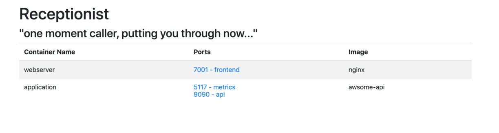

# Receptionist

*Receptionist* is a very simple Golang application that creates a single page of links to the containers you have running
on your server.

I run this on port 80 on my server, so I only ever need to remember the server hostname and Receptionist becomes the 
default landing page.

It's not a proxy of any sort, it just lists the ports that you want to show, by adding the label `RECEPTIONIST` to your
containers.

### Why?

I run a small server at home with a number of docker images running, its purely for prototyping and is no a production 
quality setup. I always forget what tool is running on what port of that server, so I wanted a simple landing page that 
would list the running containers and which port that are listening on.

> 

### Usage

#### Receptionist
`$ docker run -v /var/run/docker.sock:/var/run/docker.sock:ro -p 80:8080 cuotos/receptionist`

Here *Receptionist* is running port 80 of the host server, this means you only need to go to http://hostname and not need to remember
the port of Receptionist (but of course you can run it anywhere you want)

#### Additional Containers

You can add names to ports to make them easier to navigate in the ui. To do this set the `RECEPTIONIST` label to `<name>:<internal port>`

`docker run --name webserver -l RECEPTIONIST=api:9999 -p 5555:9999 container/image`

This will add the label "api" to the PRIVATE port 9999 (The port the docker container exposes, not where you have mounted it)

### Environment Variables (for Receptionist)

* `WATCHVAR` - The environment variable for Receptionist to look for on running containers (default `RECEPTIONIST`).

### Volumes

* `/var/run/docker.sock:ro` - Receptionist needs to be able to see what containers are running on the Docker host.

